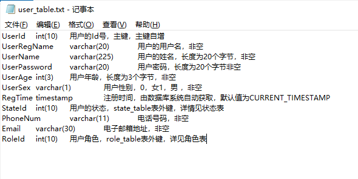
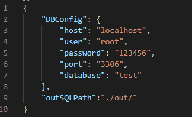

# SqlBuilder README
Easy to build MySQL table though text file  
通过文本文件轻松构建MySQL表。

## Features 功能
省去设计完表还要去建表的麻烦。

## How to use 使用方式
Open text file though VSCode. Ctrl + Shift + p open the commend line input commend.  
使用VSCode打开txt文件，然后按下Ctrl + Shift + p打开命令行，输入命令
>* `SqlBuilder.hello`: Be ensure the extension has run.  
>确定插件是否在被加载
>* `SqlBuilder.execute`: Create MySQL table though the text file.  
>通过该文本文件创建MySQL表
>* `SqlBuilder.execute_fk`: Add foreign key constraint after created all table.  
>在所有的表创建完成后，使用该命令添加外键约束。

Text file example  
txt文件范例：  
  
>  
>  
>File name is table name.  
>文件名就是表名  
>Field name,date type,comment constitutes a row, eparated by Tab. Also can copy from Word or Excel.  
>txt文件中的一行由字段名，数据类型，备注信息组成, 中间由Tab键分隔，即'\t'。可以在Word或Excel中设计好之后复制到txt中。  
>Keyword "primary key","not null","default","foreign key"can be distinguished in comment by extension.(chinese only in this version)  
>在备注信息中，可识别的关键词有“主键”，“非空”，“默认值为”，“表外键”。  
>其中，默认值为后必须跟默认值，并且以中文标点“，”结束，例如“默认值为1，xxx”。  
>表外键关键词中以中文标点“，”开头和结尾，例如“xxx，user表外键，xxx”。

config.json：在config.json中配置信息。
>   
>  
>`DBConfig`:Config database. 配置数据库的信息。  
>`outSQLPath`:Config path,output SQL file, none means dont output SQL file. 配置输出的SQL语句文件的路径，为空则表示不输出SQL语句文件

## Requirements 使用需求
* `nodejs mysql module`: Be sure you had nodejs mysql module , if not, install before apply, such as "npm install mysql".  
   在使用前确保安装了nodejs mysql模块。

## Contact 联系我

Email: ashqi@hotmail.com  
电子邮件：ashqi@hotmail.com

-----------------------------------------------------------------------------------------------------------
### For more information 更多

* [repository 存储库](https://github.com/Syclight/SQLBuilder.git)

**Enjoy!**
